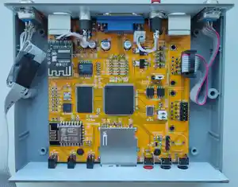

## ZX-Uno.1010
10x10cm PCB variant of ZX-Uno project

Tech specs:
- Fully compatible with ZX Uno v4.1 and ZX-Uno VGA 2M
- XC6SLX9 FPGA
- 2Mb SRAM memory
- VGA video output
- PAL/NTSC video + audio output via 3.5 jack connector (raspberry-pi compatible pinout)
- PS/2 keyboard and mouse ports
- 2xDB-9 ports for Atari-compatible joysticks
- SD/microSD card slot
- Tape input via Bluetooth module or ordinary 3.5 jack
- MIDI
- WiFi module
- MicroUSB power supply
- Board optimized for G738 and G706 cases

FAQ on official site: [link](https://uto.speccy.org/zxunofaq_en.html)

Some random photos: [link](https://cloud.err200.net/index.php/s/73TR85tYZkMm8Ax?path=%2Fzxuno1010)

### Changelog
* Rev.A - first release ([main pcb errata](pcb/rev.A/ERRATA.txt) and [covers errata](pcb_covers/rev.A/ERRATA.txt)).
* Rev.A1 - fixes all known issues of rev.A.

### References
* ZX Uno official site: [link](https://zxuno.speccy.org/index_e.shtml)
* ZX Uno VGA 2M: [link](https://github.com/ManuFerHi/ZXUNO_VGA_2M)
* Great collection of cores, games and much stuff for ZX Uno: [link](https://www.zxuno.com/forum/viewtopic.php?f=27&t=4142), [in english](https://www-zxuno-com.translate.goog/forum/viewtopic.php?f=27&t=4142&_x_tr_sl=es&_x_tr_tl=en)
