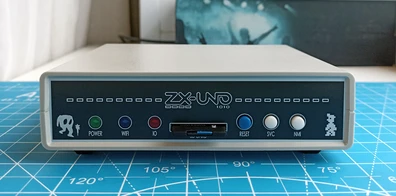

## ZX-UNO.1010
10x10cm PCB variant of ZX-Uno project

[[More photos]](images/README.md)

Tech specs:
- Fully compatible with ZX Uno v4.1 and ZX-Uno VGA 2M
- XC6SLX9 FPGA
- 2Mb SRAM memory
- VGA video output
- PAL/NTSC video + audio output via 3.5 jack connector (raspberry-pi compatible pinout)
- PS/2 keyboard and mouse ports
- 2xDB-9 ports for Atari-compatible joysticks
- SD/microSD card slot
- Tape input via Bluetooth module or ordinary 3.5 jack
- MIDI
- WiFi module
- RTC (starting from rev.B)
- Type C (starting from rev.D) or MicroUSB power supply
- Board optimized for G738 and G706 cases

FAQ on official site: [link](https://uto.speccy.org/zxunofaq_en.html)

Some random photos: [link](https://cloud.err200.net/index.php/s/73TR85tYZkMm8Ax?path=%2Fzxuno1010)

### Changelog
* Rev.A - first release ([main pcb errata](pcb/rev.A/ERRATA.txt) and [covers errata](pcb_covers/rev.A/ERRATA.txt)).
* Rev.A1 - fixes all known issues of rev.A.
* Rev.B:
    * added RTC
    * changed second joystick port wiring - in rev.A it's has been wired like in ZXUNO-VGA2M, but now it's wired like Joysplitter, which is officially supported way
    * joysticks are now powered by +5V rail instead of +3.3V - this should improve compatibility with various RF gamepads
    * optimized SAM2695 footprint for hand soldering
    * added opamp for proper MIDI sound mixing
    * added buffer in DAC circuit
    * added separate LDO for SD card and WiFi module
    * added resistor between WiFi's GPIO15 and GND to prevent IC heating
    * remove beeper (which wasn't used anyway)
    * improved power distribution for FPGA chip
    * pcb corners are rounded now
    * experimental tape-in circuit
* Rev.C:
    * added dedicated LDO for audio to improve noise floor
    * added optional capacitor for NTSC quartz stability
    * added missing decoupling capacitor on RTC power rail
    * added current-limiting resistors after opamp on sound output
    * changed R76, R80 from 10kΩ to 8.2kΩ
    * changed U10 opamp from NE5532 to LMV358 as it better suited for low-voltage operation
    * 3mm front leds replaced by 5mm
    * experimental reset circuit based on MAX809
    * reverted to old tape-in circuit
* Rev.D:
    * used USB Type C instead of Micro USB
    * PJ-320 3.5mm jack replaced by PJ-322
    * added solder jumper to select 3.5mm jack CVBS pinout
    * MIDI synthesizer U6 uses clean analog power rail now
    * improved W25Q128 footprint to able to install IC in WSON package
    * some minor PCB layout changes to reduce WiFi interference
    * reverted to old reset circuit
* Rev.D1:
    * changed R16 from 220Ω to 1kΩ to reduce power led bightness
    * changed R70, R71 from 10kΩ to 12kΩ to improve balance with AY
    * changed C51 from 100nF to 1uF to improve audio noise floor
    * changed C13 value as some quartz failed to start with 4.3pF load
    * changed U17 from LP2985-3.3 to TPS7A2033PDBVR due to better PSRR
    * changed U15 from 74LVC2G34 to 74LVC2G04 as it's more common in my projects

### References
* ZX Uno official site: [link](https://zxuno.speccy.org/index_e.shtml)
* ZX Uno VGA 2M: [link](https://github.com/ManuFerHi/ZXUNO_VGA_2M)
* Great collection of cores, games and much stuff for ZX Uno: [link](https://www.zxuno.com/forum/viewtopic.php?f=27&t=4142), [in english](https://www-zxuno-com.translate.goog/forum/viewtopic.php?f=27&t=4142&_x_tr_sl=es&_x_tr_tl=en)
